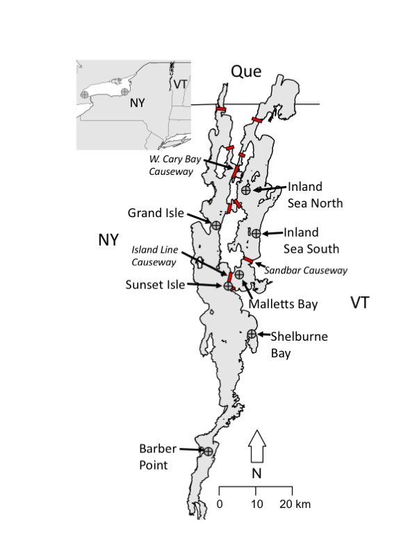

***
</script>

 

Jude, DJ, Rudstam, LG, Holda, TJ, Watkins, JM, __Euclide, PT__, Balcerd, MD. In Review. Trends in Mysis diluviana abundance in the Great Lakes, 2006-2016.

__Euclide, PT__, Marsden, JE. In Review. Role of drainage and barriers in the genetic structuring of a tessellated darter metapopulation. Freshwater Biology.

__Euclide, PT__, Flores, NM, Wargo, MJ, Kilpatrick, CW, Marsden, JE. 2017. Lack of population genetic structure of slimy sculpin in a large, fragmented lake. Ecology of Freshwater Fish.

__Euclide, PT__, Hansson, S, Stockwell, JD. 2016. [Partial diel vertical migration in an omnivorous macroinvertebrate, Mysis diluviana.](pdfs/Euclide et al 2017.pdf) Hydrobiologia. doi:10.1007/s10750-016-2982-5.

__Euclide, PT__, Stockwell, JD. 2015. [Effect of gut content on δ15N, δ13C, and C:N of experimentally- fed Mysis diluvaiana.](pdfs/Euclide and Stockwell 2015.pdf) Journal of Great Lake Research. 41: 926-929.

[researchgate](https://www.researchgate.net/profile/Peter_Euclide)

[click here to download my CV](pdfs/CV.pdf)

 

