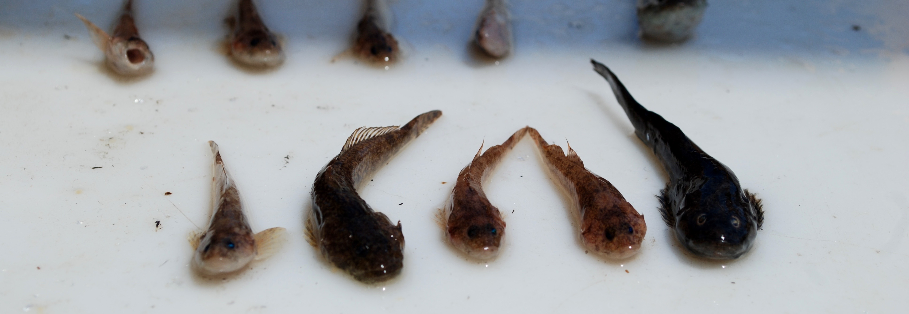

***
###_Sculpin structure:_
***

Due to difficulties sampling, most what we know about the dispersal and behavior of sculpins comes from lotic environments. However, sculpin are also a common benthic fauna in many lakes and can be an important prey source for larger fish such as lake trout. To better understand differences between lotic and lentic populations of sculpins we assessed the genetic structure of slimy sculpin in Lake Champlain and Lake Ontario. Using the allele frequencies across 9 microsatellite loci of 248 slimy sculpin collected from 8 sites in Lake Champlain and 2 sites in Lake Ontario we evaluated how distance and anthropogenic habitat fragmentation influenced genetic structure of sculpins. In contrast to similar studies conducted in streams, we found no evidence of isolation by distance or barrier, despite relatively large differences between lakes. 

__Manucript status:__ In review

***
###_Mysis partial diel vertical migration (DVM)_

***

Mysis diluviana are a common macro-zooplankton in deep North American lakes. To access to energy rich zooplankton near the surface while limiting spatial overlap with predators, Mysis exhibit large diel vertical migrations (DVM), moving nightly to the surface and returning to the lake bottom by dawn. However, as omnivores Mysis can utilize benthic food sources such as detritus to supplement their diet and recent some studies have found that a subset of the population foregoes nightly migrations and remain on the bottom at night. Using stable isotopes and basic demographic data we identified and evaluated extensive partial DVM in Lake Champlain. We found that individuals that remained on the bottom at night tended to be larger, have a higher C:N ratio indicative of higher lipid content, and were more often gravid females than Mysis found near the surface. 

__Euclide, P. T.__, Hansson, S., & Stockwell, J. D. (2017). Partial diel vertical migration in an omnivorous macroinvertebrate, Mysis diluviana. Hydrobiologia, 787(1), 387–396. http://doi.org/10.1007/s10750-016-2982-5

__Euclide, P. T.__, & Stockwell, J. D. (2015). Effects of gut content on δ15N, δ13C and C:N of the macroinvertebrate Mysis diluviana. Journal of Great Lakes Research (Vol. 41).

***
###_Mysis density dataset_ 
***

As stated above, Mysis are a common macro-zooplankton throughout North America. In addition to a large native range in Eastern North America, Mysis were purposefully added to many western lakes to boost sport fish productivity such as lake trout and kokanee including many lakes in Colorado. Because Mysis are a important source of food for fish and an important predator of zooplankton, Mysis density can be a important predictor of system productivity. However, documentation of Mysis density has been inconsistent and not easily accessible. Therefore, we have begun to assemble a central dataset of Mysis density data from across North America, though most our data is from the Great Lakes.

__RShiny App:__ https://peter-euclide.shinyapps.io/Mysis_density_app/

***
###_Impact of low quality diet on swimming performance and essential fatty acids_
***

Humans can have a dramatic impacts on ecosystem health, such as climate change, nutrient loading and habitat degradation and each impact has created a variety of compounding stresses for ecological communities (Ficke et al., 2007). Eutrophication of aquatic environments from industrial and agricultural run-off has led to increased harmful algal blooms in many lake and coastal areas. These blooms have many negative consequences including decreased food source diversity and quality for secondary consumers. For example, Cyanobactreria which commonly make up harmful algal blooms lack docosahexanoic acid (C22:6 n-3, DHA), eicosapentenoic acid (C20:5 n-3, EPA) and arachadonic acid (C20:4 n-6, ARA; Ahlgren, 1992) which are essential bioactive fatty acids. To test how food webs dominated by Cyanobacteria could be transferred up the trophic ladder we conducted a two-month feeding experiment of zebra fish (Danio __) where half of the fish were fed a diet lacking certain fatty acids commonly lacking in cyanobacteria while the remaining individuals were fed the same diet but supplemented in the fatty acids lacking from the treatment diet. Fish were then subjected to tests of swimming performance and respiration and analyzed for fatty acid composition at 5 times throughout an 8 week trial.  We discovered that fish EFA composition of fish changed rapidly and were detectably different from the baseline after just two weeks. Addtionally, we found that fish fed the diet lacking EFA had lower swimming ability than fish fed a complete diet. 

__Manucript status:__ In preperation

<iframe src="https://player.vimeo.com/video/170673352" width="640" height="640" frameborder="0" webkitallowfullscreen mozallowfullscreen allowfullscreen></iframe>

<a href="https://vimeo.com/170673352">JunkFoodHypothesis</a> from <a href="https://vimeo.com/user38109713">Victoria Pinheiro</a> on <a href="https://vimeo.com">Vimeo</a>.

