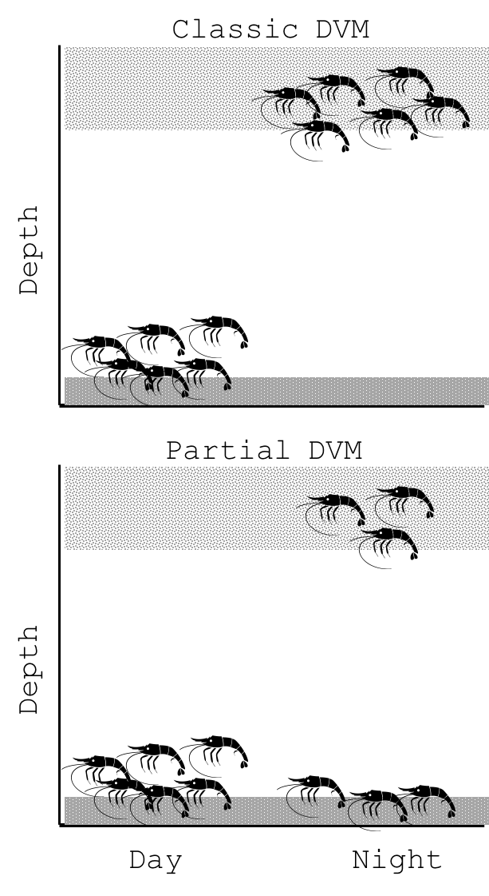

  

  

   
  
***
#__Habitat fragmentation of slimy sculpin in lakes__
***
###__Question:__ 
Do lake causeways and distance make a difference to populations of slimy sculpin in lakes?

###__Answer:__ 
Not really.

* Slimy sculpin are panmictic throughout Lake Champlain, even across substantial dispersal barriers.
* Slimy sculpin show no indication of IBD across more 60+ km in Lake Champlain and 240+ km in Lake Ontario. 

###__Read More:__

__Euclide, PT__, Flores, NM, Wargo, MJ, Kilpatrick, CW, Marsden, JE. 2017. Lack of population genetic structure of slimy sculpin in a large, fragmented lake. Ecology of Freshwater Fish.

  

  

       

   

  

  

***

 

  

    
   
  

  

   
  
***
#__Mysis diluviana partial diel vertical migration (DVM)__
***
###__Question:__ 

Do _all_ _Mysis_ migrate to the surface every night? Or do some stay on the bottom?

###__Answer:__ 

Some _Mysis_ like to stay put. 

* Larger and fecund _Mysis_ are more likely to stay on the bottom at night than smaller individuals. 

* Fatter _Mysis_ are more likely to stay on the bottom at night than hungry _Mysis_. 

###__Read More:__

__Euclide, PT__, Hansson, S, Stockwell, JD. 2016. [Partial diel vertical migration in an omnivorous macroinvertebrate, Mysis diluviana.](pdfs/Euclide et al 2017.pdf) Hydrobiologia. doi:10.1007/s10750-016-2982-5.

  

***

  

   
  
***
#__The effect of gut content on stable isotope analysis__
***  

###__Question:__ 

Does the gut content of a organism bias stable isotope analysis?

###__Answer:__ 

Nope.

* δ15N, δ13C, and C:N was the same for Mysis with evacuated guts and guts full of Artemia, Green Algae. 

###__Read More:__

__Euclide, PT__, Stockwell, JD. 2015. [Effect of gut content on δ15N, δ13C, and C:N of experimentally- fed Mysis diluvaiana.](pdfs/Euclide and Stockwell 2015.pdf) Journal of Great Lake Research. 41: 926-929.

 

  

     

   

  

  

***

 

  

    
  <iframe src="https://player.vimeo.com/video/170673352" width="300" height="300" frameborder="0" webkitallowfullscreen mozallowfullscreen allowfullscreen></iframe>

<a href="https://vimeo.com/170673352">JunkFoodHypothesis</a> from <a href="https://vimeo.com/user38109713">Victoria Pinheiro</a> on <a href="https://vimeo.com">Vimeo</a>.

  

  

   
  

***
#__Impact of low quality diet on swimming performance and essential fatty acids (EFA)__
***

###__Question:__ 

Could cyanobacteria blooms limit fish fitness by limiting nutrition in a lake food web?

###__Answer:__ 

Probably. At least a little bit.

* Swimming performance was positively related to EFA. 

* Fish fatty acid content changes rapidly (within two weeks).

* The interactions between EFA and swimming performance are complex, and can be contradictory. 

###__Read More:__

__Manuscript in preperation.__

  

***
#_Mysis density dataset_ 
***

As stated above, Mysis are a common macro-zooplankton throughout North America. In addition to a large native range in Eastern North America, Mysis were purposefully added to many western lakes to boost sport fish productivity such as lake trout and kokanee including many lakes in Colorado. Because Mysis are a important source of food for fish and an important predator of zooplankton, Mysis density can be a important predictor of system productivity. However, documentation of Mysis density has been inconsistent and not easily accessible. Therefore, we have begun to assemble a central dataset of Mysis density data from across North America, though most our data is from the Great Lakes.

__RShiny App:__ https://peter-euclide.shinyapps.io/Mysis_density_app/

***

peuclide@uvm.edu