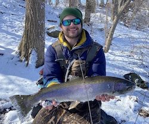

***
# Current Lab Members
***

:::: {style="display: grid; grid-template-columns: 60% 40%; grid-column-gap: 10px; "}

::: {}

Max’s research focuses on identifying genetic and phenotypic variation among sympatric ecomorphs of lake charr (Salvelinus namaycush) across their native range. He employs modern approaches, including whole genome sequencing, computer vision, morphometrics, and immunohistology, to investigate divergence among ecomorphs.

Before coming to Indiana University, Max earned his MS from Purdue University and his BS and BA from the University of Virginia. Outside of research, he enjoys fly fishing, hunting, playing guitar, cooking, and spending time with his dog.

    

:::

::: {}

:::

::::

***
