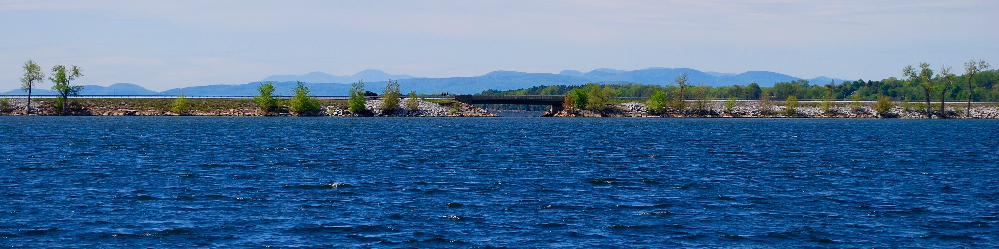
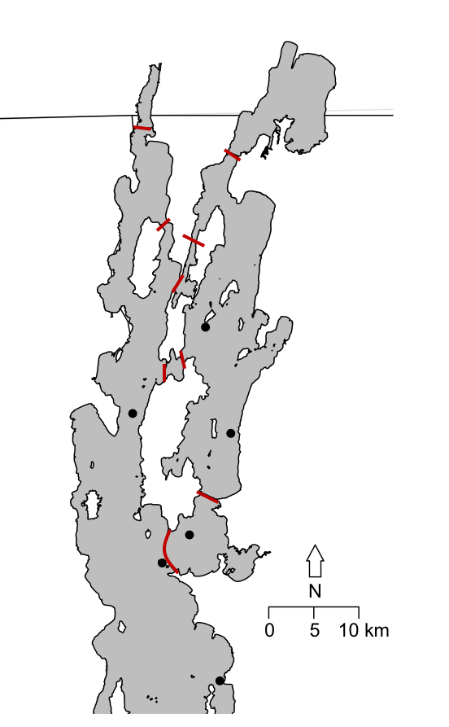
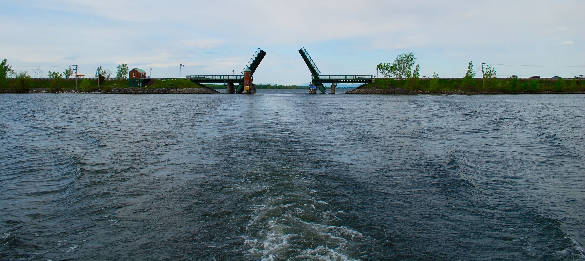

***

_Habitat Fragmentation_
---
Habitat fragmentation is a major conservation issue impacting aquatic environments. My research goal is to understand how humans influence the evolution of aquatic species by constructing dams and other aquatic barriers which unnaturally isolate populations. In Vermont, there are over 1000 dams and numerous road crossings, many of which form complete or partial barriers to fish movement. Using both genetic techniques and behavioral ecology, I aim to determine how different species interact with barriers and how the structure and age of barriers influences the population structure of fish populations. 

***
###_The influence of three distinct barrier types on population structure_
***

Barrier type and age are important predictors of the impact a given barrier could have on the natural community of a stream and the movement of species in the area (Gouskov & Vorburger, 2016). By examining the genetic structure of tessellated darter (Etheostoma olmstedi) across three types of barriers present in the Lake Champlain watershed (lake causeways, low-head dams, and a natural fall line) I will be able to understand how the type and age of barrier influences gene flow. Currently, we have collected darters above and below the fall line, above and below dams below the fall line, and in the major basins of Lake Champlain separated by causeways. By genotyping 30 to 50 individuals from each sample location at a suite of 9 microsatellite loci I will be able to effectively compare the population-level impacts of three types of barriers.

___We hypothesize:___

1)	Genetic distance is positively correlated with barrier age.

2)	Genetic distance is greater around complete barriers such as dams and fall lines than it is around partial barriers such as causeways.

***
###_Whole lake fragmentation: how do causeways impact the genetic population structure of fish_
***

The life history of a species can have large impact on its sensitivity to habitat fragmentation (Henle et al., 2004). Life history traits such as dispersal ability, early life stage movement, foraging behavior could all influence how a species is or is not influenced by a barrier. Because the role of small differences in species ecology in determining evolution and structuring of populations is poorly understood, recent studies have called for additional research using multiple species to improve models that predict the long-term effects of changes in landscape structure, such as habitat fragmentation (Richardson et al., 2016). By examining the impact of the same barriers on multiple species with various ecological niches ability I aim to fill this partially fill this gap research while establishing the impact of an under-researched type of barrier (causeways). Currently, we have begun genotyping three native to Lake Champlain, rainbow smelt, lake whitefish and lake cisco collected from three basins of Lake Champlain (figure 1). By comparing differences in genetic structuring among these three species I aim to evaluate the variation of effects causeways can have on the population structure of fish populations. 

___We hypothesize:___

1)	Genetic distance will be negatively correlated with dispersal ability.

2)	Populations sampled on either side of a causeway will be more genetically distinct from one another than those sampled on the same side of a causeway.

***
###_Influence of lake causeways on dispersal and behavior of walleye:_
***

Walleye are an economically and ecologically important species in Lake Champlain and throughout North America with high recreational interest. However, walleye populations in Lake Champlain have been declining slowly since the 1960s (Marsden & Langdon, 2012). Though populations remain sufficient for recreational needs, the cause of the decline is unknown. To begin to understand basic walleye movement patterns and behavior in Lake Champlain we are using three different techniques. First, we are evaluating trends in walleye movement across causeways and between spawning rivers using over 40 years of mark-recapture data collected by the state of Vermont Fish and Wildlife Department. Second, using acoustic telemetry we are able to track 26 walleye throughout Lake Champlain; examining how individual fish interact with causeway openings and assess seasonal migrations around the lake. Finally, by assessing the genetic structure of four major spawning rivers around the lake we are able to estimate gene flow and straying among spawning sites to better understand how walleye populations are structured in Lake Champlain. 

___We Hypothesize:___

1)	Walleye movement throughout Lake Champlain is impeded by lake causeways.

2)	Natal site fidelity determines population genetic structure regardless of barriers.

3)	Genetic similarity between natal sites is structured by causeways.

