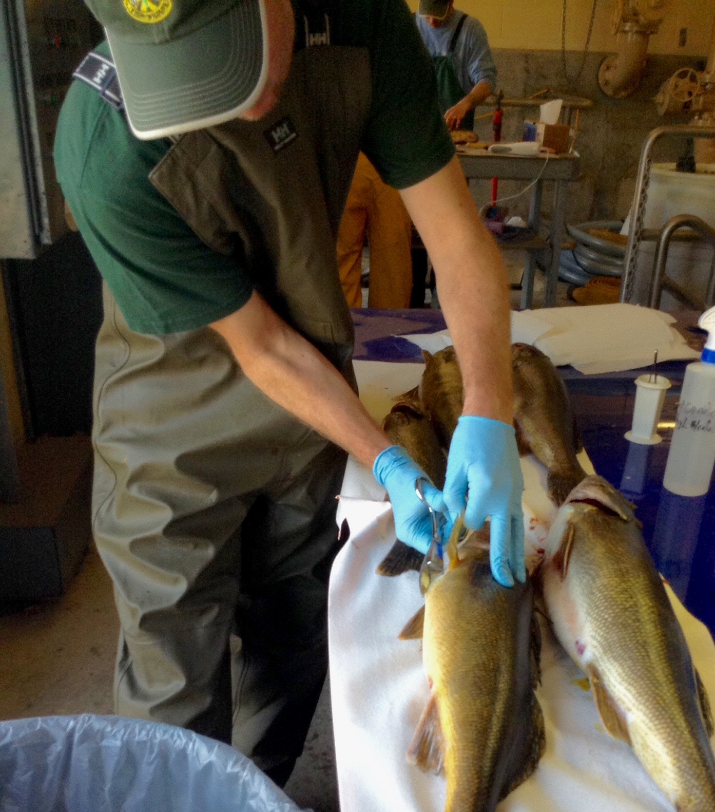

  

  

   
  
***
#__Defining stock structure of Rainbow Smelt in Lake Champlain:__
***

###__Background:__ 
Lake Champlain is divided into three major basins by large causeways. Current management of forage fish takes place in all basins, but no research has been conducted to evaluate the genetic stock structure of the population. 

###__Questions:__ 
1) Do rainbow smelt in Lake Champlain constitute a single genetic population or are populations structured by basin?

2) Does genetic data support demographic data of stock structure?

###__Project status:__

Manuscript in preparation.

  

  

   
  Dots indicate sample locations and red lines indicate causeways.

  

  

***

 

  

    
   
  

  

   
  
***
##__Genetic structure of whitefish in Lake Champlain__
***

###__Background:__ 
Whitefish are a important commercial species in the Great Lakes and were also historically commercially harvested in Lake Champlain. Despite historic importance, little is known about the current status of whitefish in Lake Champlain.

###__Questions:__ 

1) Have lake causeways fragmented whitefish enough to genetically structure the population?

2) Is there any evidence of a bottleneck in whitefish populations associated with commercial fishing?

###__Project status:__

Genotyping and analyzing data. 

  

***

  

   
  
***
##__Movement and genetic structure of walleye in Lake Champlain__
***  

###__Background:__ 
Walleye are an economically and ecologically important species in Lake Champlain and throughout North America. However, walleye populations in Lake Champlain have been declining slowly since the 1960s (Marsden & Langdon, 2012). Our goal is to use a combination of genetic, mark and recapture, and telemetry data better understand the dispersal and movement of Walleye in the lake. 

###__Questions:__ 

1) Do spawning rivers constitue distinct genetic populations of walleye?

2) Are walleye easily able to cross lake causeways?

3) What is the straying rate of walleye between spawning rivers?

###__Project status:__

Genotyping walleye from four major spawning rivers. 

 

  

     

   
    
   

  

  

