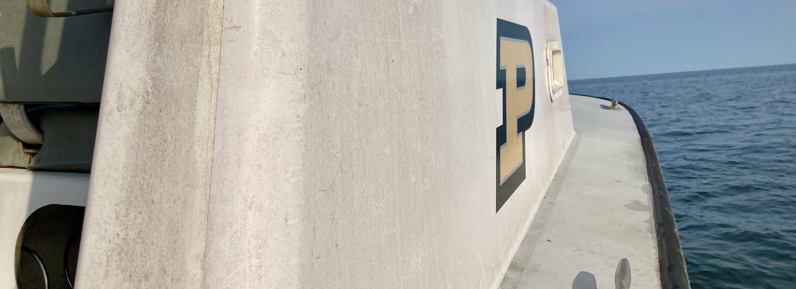
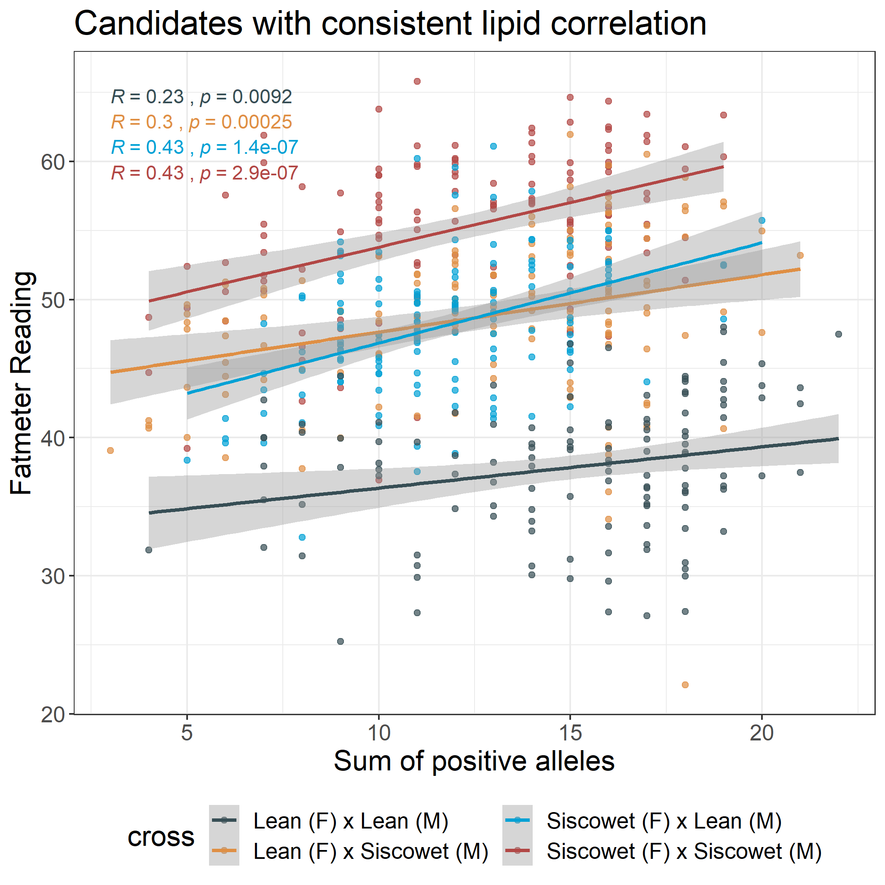
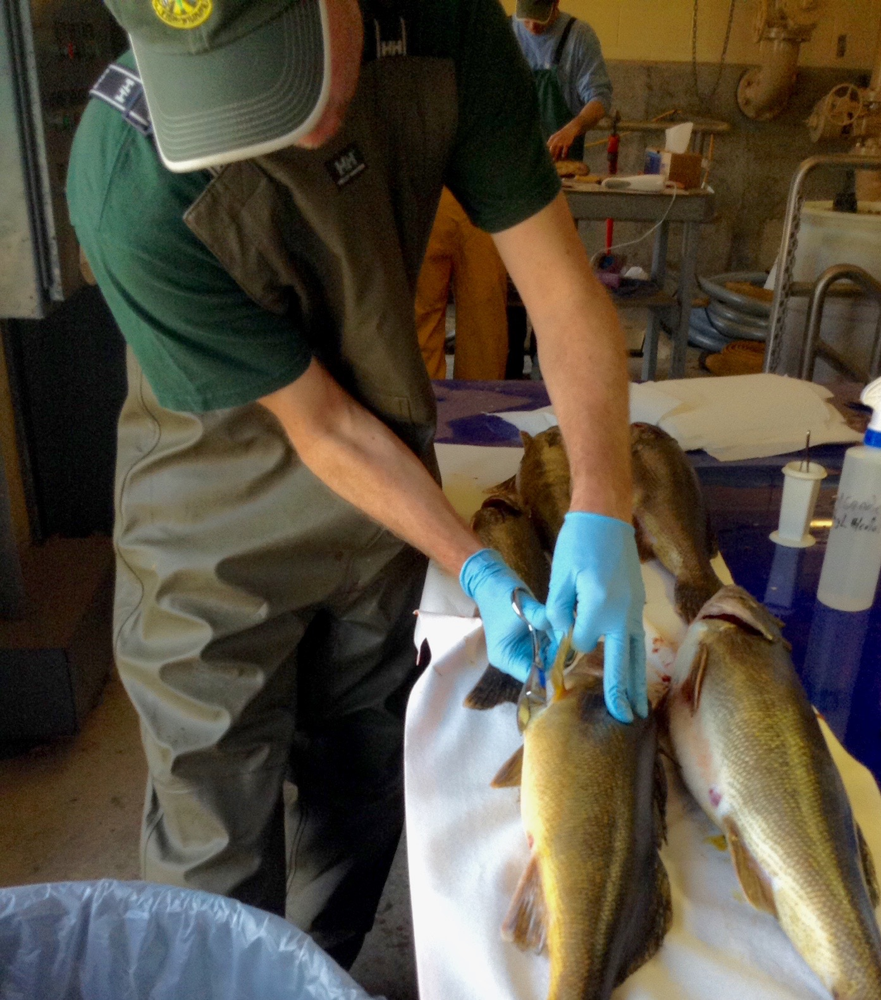
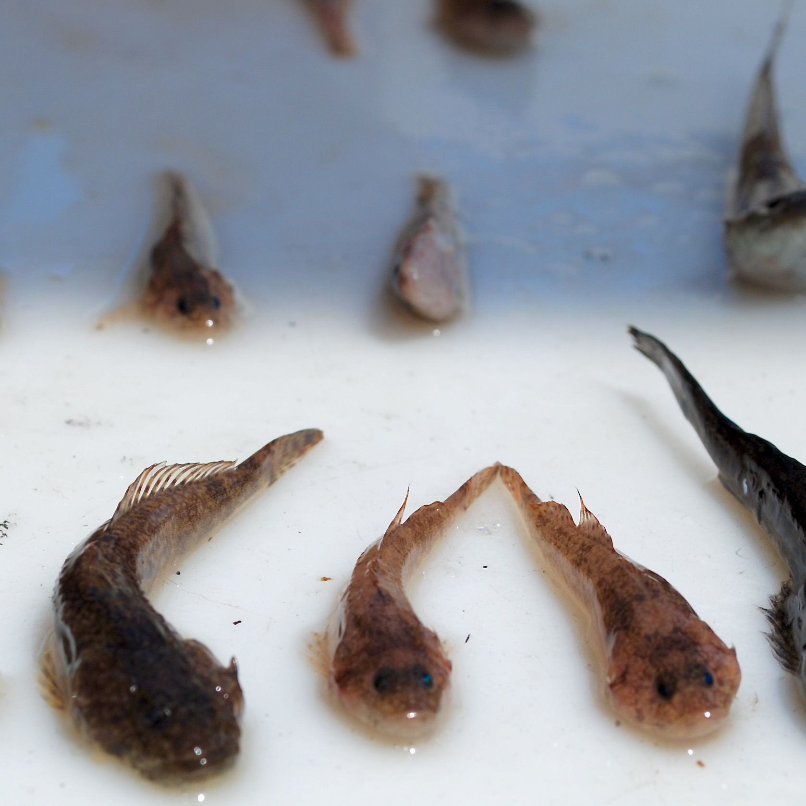
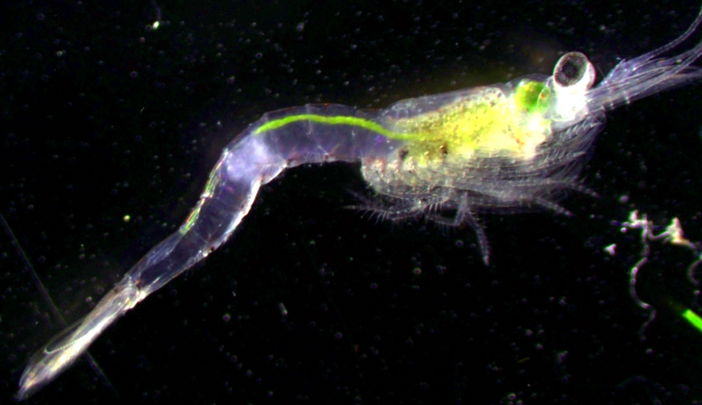

:::: {style="display: grid; grid-template-columns: 60% 40%; grid-column-gap: 10px; "}

::: {}
***  
# Molecular drivers of ecotypic divergence
***

Populations are often comprised of discrete ecotypes with distinct morphology or behavior in the absence of reproductive isolation. One of my research objectives is to identify both the molecular mechanisms and environmental drivers of ecotypic divergence. Understanding how local adaptation within a population can lead to diverged ecotypes has important implications for speciation research and the conservation diversity. My work uses molecular techniques, such as RAD-sequencing and whole-genome-resequencing, to identify putatively adaptive variance among ecotypes or populations. Using these approaches, I have been able to identify SNPs that are linked to lipid content in F2 experimental lake trout crosses (right) and help to uncover how structural variants contribute to spawning ecotypes in sockeye salmon.

:::

::: {}

    

:::

::::

***  

:::: {style="display: grid; grid-template-columns: 40% 60%; grid-column-gap: 10px "}

::: {}

 

:::

::: {}

***  
# Improving management decisions with genetic data
***

Recreational and commercial fisheries are a valuable industry throughout the world. Exploited fish populations are exposed to a suite of anthropogenic influences often not experienced by other species, such as direct harvest, stocking, and translocations. In the Great Lakes, walleye support a large fishery which has resulted in a patchwork of natural, stocked, and recovering spawning populations or stocks, each contributing differently to the overall population abundance. The complex combination of naturally reproducing and recovering stocks require managers to consider multiple discrete spawning populations when estimating stock recruitment and determining sustainable harvest quotas. My research aims to (1) understand how discrete walleye stocks throughout the Great Lakes contribute to a large Great Lakes wide metapopulation, and (2) how spawning site fidelity and dispersal help to sustain exploited populations and result in local adaptation.
:::

::::

***

:::: {style="display: grid; grid-template-columns: 60% 40%; grid-column-gap: 10px; "}

::: {}

***  
# Genetic consequences of habitat fragmentation
***

Humans have altered the natural connectivity of fish populations through constructing damns and causeways that limit fish dispersal and ultimately gene flow which can lead to population sub-structuring across a species range. Many barriers affecting species throughout North America were built recently, and so I work at intercept between behavioral ecology and evolutionary biology using molecular techniques, long-term demography, and mark-recapture datasets to understand how populations have adjusted to lost connectivity. In Lake Champlain, I used population genetic and fisheries data to describe patterns of neutral genetic structure and population demographics of fish native to Lake Champlain which has been fragmented by seven causeways built during the early twentieth century. 

:::

::: {}

:::

::::

***  

  

# Additional research areas

***

:::: {style="display: grid; grid-template-columns: 40% 60%; grid-column-gap: 10px; "}

::: {}

  

:::

::: {}

***  
## Applying trophic markers to trace movement 
***

When populations are not fully reproductively isolated, genetic markers provide limited information about functional connectivity. Using trophic markers such as of stable isotopes and basic demographic data can help identify ecological breaks in population connectivity.

:::

::::

***

:::: {style="display: grid; grid-template-columns: 60% 40%; grid-column-gap: 10px; "}

::: {}
***  
## Quantifying environmental stressers
***

Understanding how local environment influences individual fitenss is an important step in determining how species adapt to novel stressors. One emerging stressor in aquatic habitats is harmful cyanobacteria blooms. Because cyanobacteria have little nutritional value for zooplankton, it is possible that higher trophic levels such as fish are impacted by the influx of nutrition poor cyanobacteria at the base of the food web. Working with a colleague trained in lipid analysis, we conducted a two-month experiment to determine how essential fatty acid poor diets, like what might happen during a long cyanobacteria bloom, impact fish fatty acid content, swimming performance and respiration.

:::

::: {}

  <iframe src="https://player.vimeo.com/video/170673352" width="300" height="300" frameborder="0" webkitallowfullscreen mozallowfullscreen allowfullscreen></iframe>

<a href="https://vimeo.com/170673352">JunkFoodHypothesis</a> from <a href="https://vimeo.com/user38109713">Victoria Pinheiro</a> on <a href="https://vimeo.com">Vimeo</a>.

:::

::::

***

