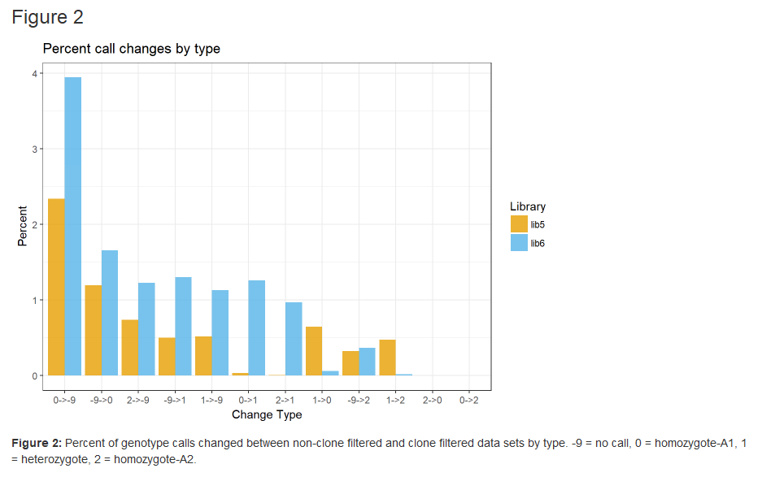
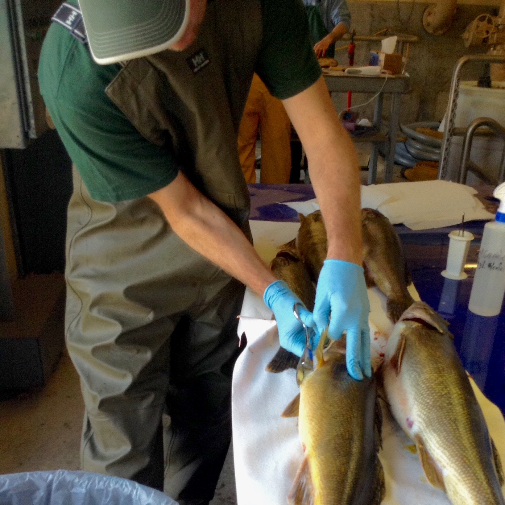
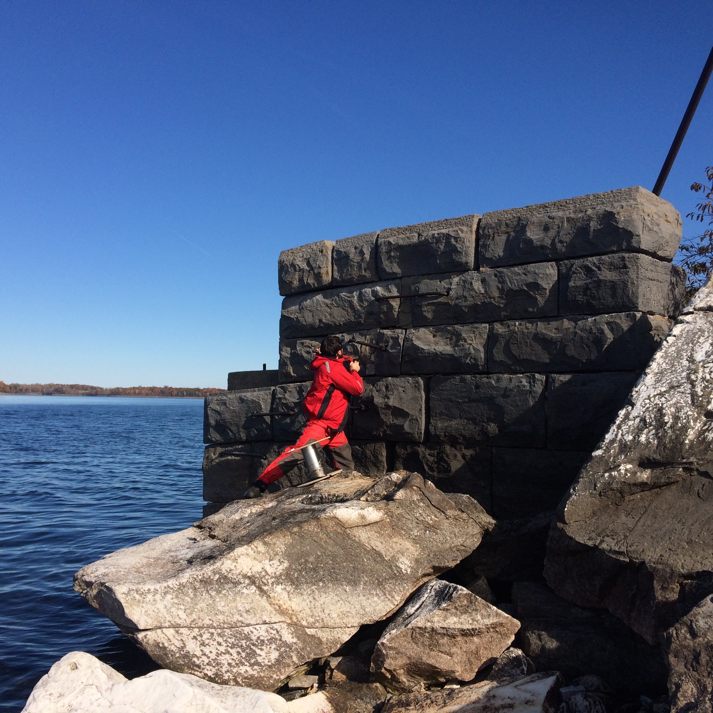
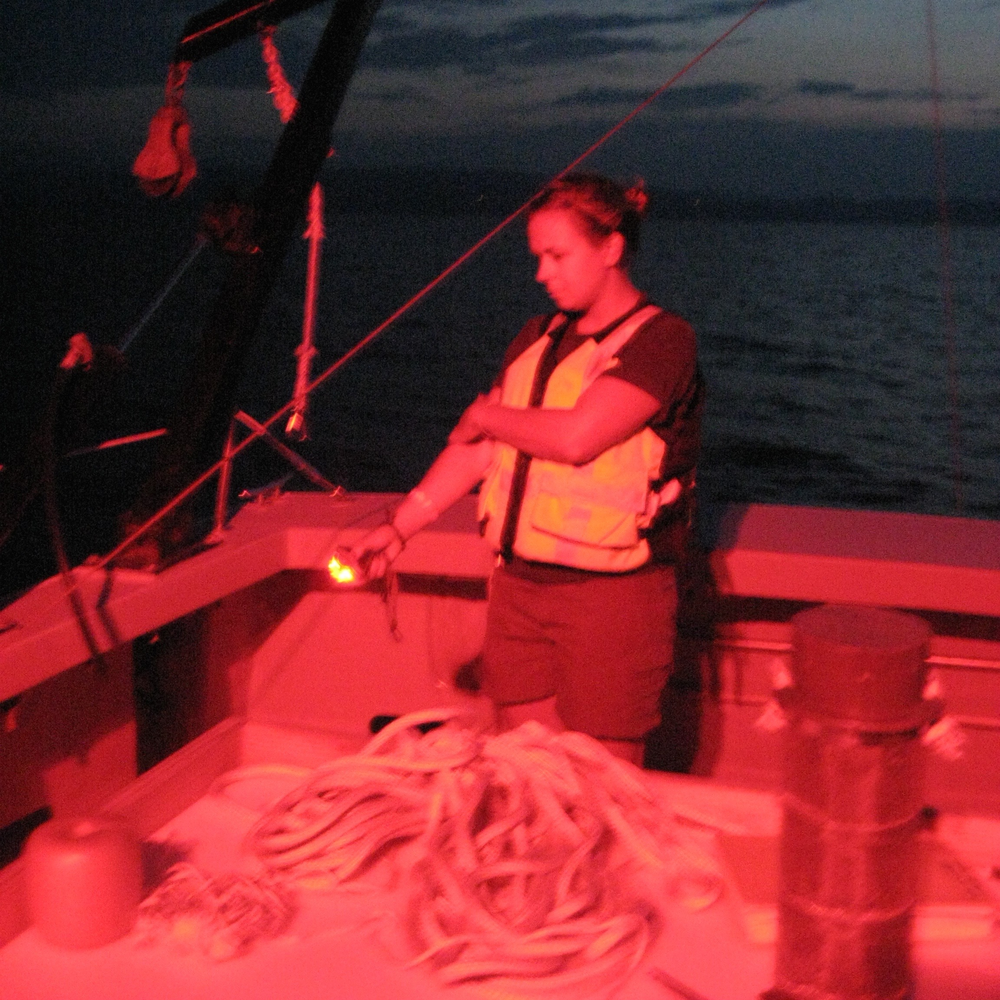

  

   

***  
#__Current Research__
***

I am currently working as a postdoc with Wes Larson at the USGS Wisconsin Cooperative Fishery Research Unit at UW-Stevens Point on a range of genomics based projects. Our lab focuses on using RAD-Seq and other techniques reduced representation methods to idetify spatial structure in fish populations and develop SNP panels for fisheries managment. I am currently involved in a range of projects including a methods analysis of impact of PCR duplicates on RAD-seq analysis, the development of a walleye SNP panel, and a metagenomic assessment of Wisconsin lakes and rivers.  

  

        
   

***
 

  

   

 

***
#__Ph.D. Research__
***
My Ph.D. reserach focused on understanding how barriers limit fish dispersal and ultimately gene flow which can lead to population sub-structuring across a species range. My current research is at the intercept between behavioral ecology and evolutionary biology using molecular techniques, long-term demography and mark-recapture datasets to describe patterns of genetic diversity and structure in five species of fish native to Lake Champlain in the face of increasing habitat fragmentation.

 

 

  

  

    

  

  

***

 

  

    
   
  

  

   
  

***  
#__Masters Research__
***

My interest in behavioral ecology stems from my thesis research on partial diel vertical migration behavior of _Mysis diluviana_ in Lake Champlain. Using a combination of stable isotopes and basic demographic data I determined that gravid females and large _Mysis_ with higher C:N content (lipid content) were more likely to remain on the bottom at night while the rest of the population migrated to the surface to feed.

    

 
 

  

***
 

  

   

 

*** 
#__Side Projects__
***

Harmful cyanobacteria blooms are a global issue. Because cyanobacteria have little nutritional value for zooplankton, it is possible that higher trophic levels such as fish are impacted by the influx of nutrition poor cyanobacteria at the base of the food web. Working with a colleague trained in lipid analysis, we conducted a two-month experiment to determine how essential fatty acid poor diets, like what might happen during a long cyanobacteria bloom, impact fish fatty acid content, swimming performance and respiration.

  

     

  <iframe src="https://player.vimeo.com/video/170673352" width="300" height="300" frameborder="0" webkitallowfullscreen mozallowfullscreen allowfullscreen></iframe>

<a href="https://vimeo.com/170673352">JunkFoodHypothesis</a> from <a href="https://vimeo.com/user38109713">Victoria Pinheiro</a> on <a href="https://vimeo.com">Vimeo</a>.

  

  

***

 

  

    

   
 

  

  

   

***  
#__Apps and Data__
***

I believe that making data accessible and easy to visualize is an important step in replicable, transparent science. Making my data accessible through public databases such as [KNB](https://knb.ecoinformatics.org/#view/knb.749.1), code sharing through [GitHub](https://github.com/peuclide/), and data visualization with my own [RShiny](https://peter-euclide.shinyapps.io/Mysis_density_app/) are just a few ways that I have tried to make my own science more accessible.

  

 

  

***

<left>
Contact me: peuclide@uvm.edu 
