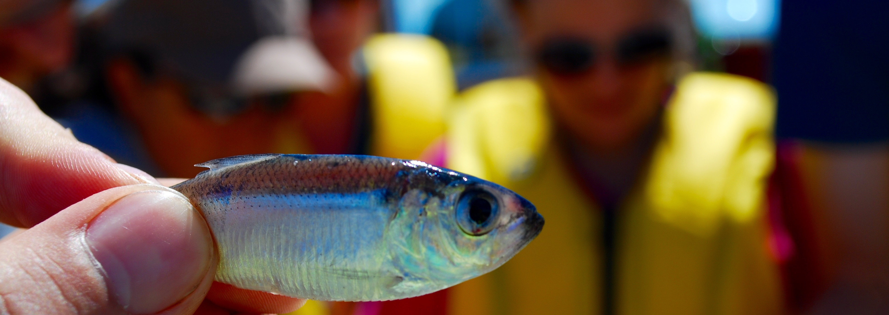

I believe that one of the most important steps in research is the dissemination of knowledge and results to a wide audience. Therefore, I do my best to work collaboratively with educators and the public to explain my own research and show people that science can be interesting and available to everyone. Below are some of the collaborations and experiences that that I have had the opportunity to be a part of.

***
###_ECHO Science Translation Fellowship_
***

Science centers provide a much-needed outlet for bringing scientific research to the public.  They are a platform where learning is fun and each person can have a different experience.  However, it can be difficult to keep the visitors’ experience fresh and up-to-date with what is happening now in science. For this reason, in 2013 I worked with the ECHO Lake Aquarium and Science Center for a year as the science-education fellow to create a symbiotic relationship between ECHO and the Rubenstein Ecosystem Science Laboratory. The goal of my fellowship was to create a relationship where ECHO can benefit from the knowledge and expertise of RSENR researchers while we can benefit from the educational expertise and outreach capacity of ECHO.

***
###_CREST Teacher works shop_
***

The Champlain Research Experience for Secondary Teachers (CREST) Professional Development Program is a summer work shop that gives 7-12th grade teachers the opportunity to partake in hands on research with professors and graduate students in at the University of Vermont.  For three years, I worked as the graduate assistant for the CREST program helping plan and facilitate the week-long work shop. My role involved taking 10 – 20 teachers into the field to help with ongoing research at UVM. Over three years we were able to expose teachers to a range of ecological research including water quality monitoring, benthic and pelagic sampling of invertebrates and zooplankton and benthic trawling for lake trout and sculpin aboard the R/V Melosira. Our goal was to help link cutting-edge STEM research methods being used in the field with 7-12th grade classes throughout Vermont. 

***
###_Student mentoring_ 
***

While at the University of Vermont I have had the opportunity to mentor many undergraduate students including three work study students, one summer REU student and several undergraduate volunteers and field techs. Mentoring the next generation of researchers is an important step in the scientific process. I believe that quality early career mentorship leads to more successful scientists and better research. Therefore, I have always taken my position as a mentor seriously and take a personal interest in making sure the students I work with leave with the necessary skills to be successful in their field. 

