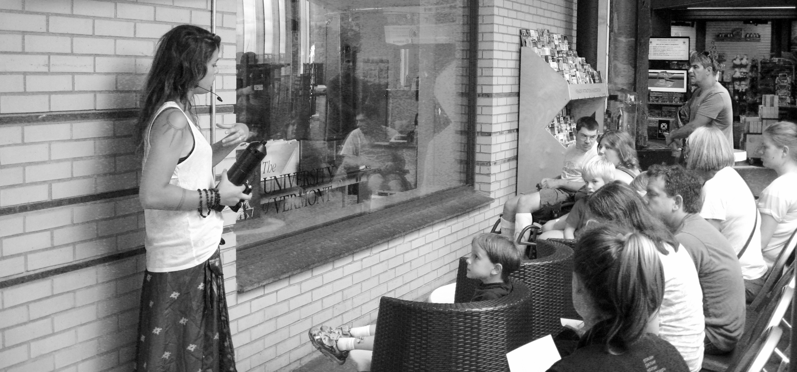
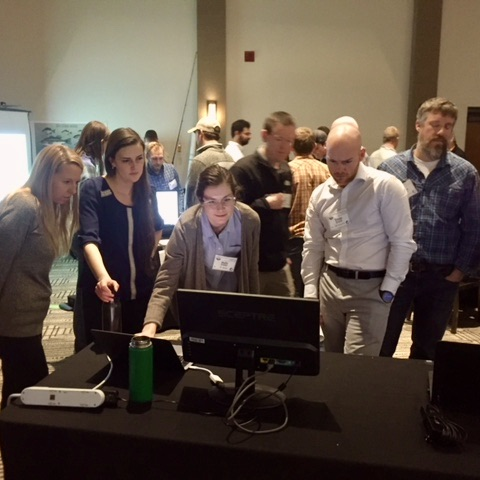
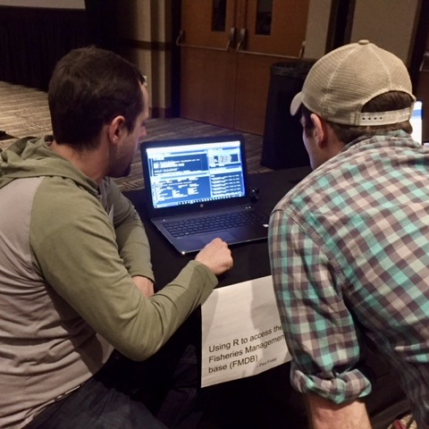
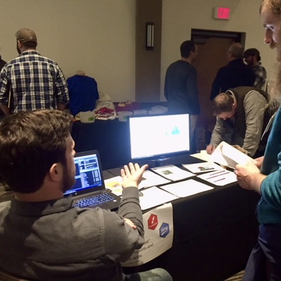
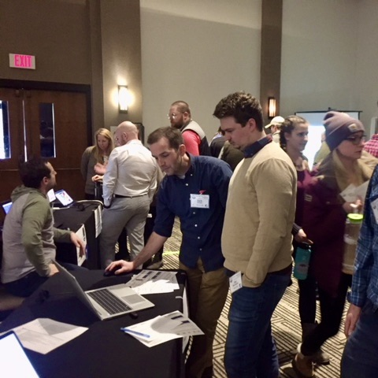
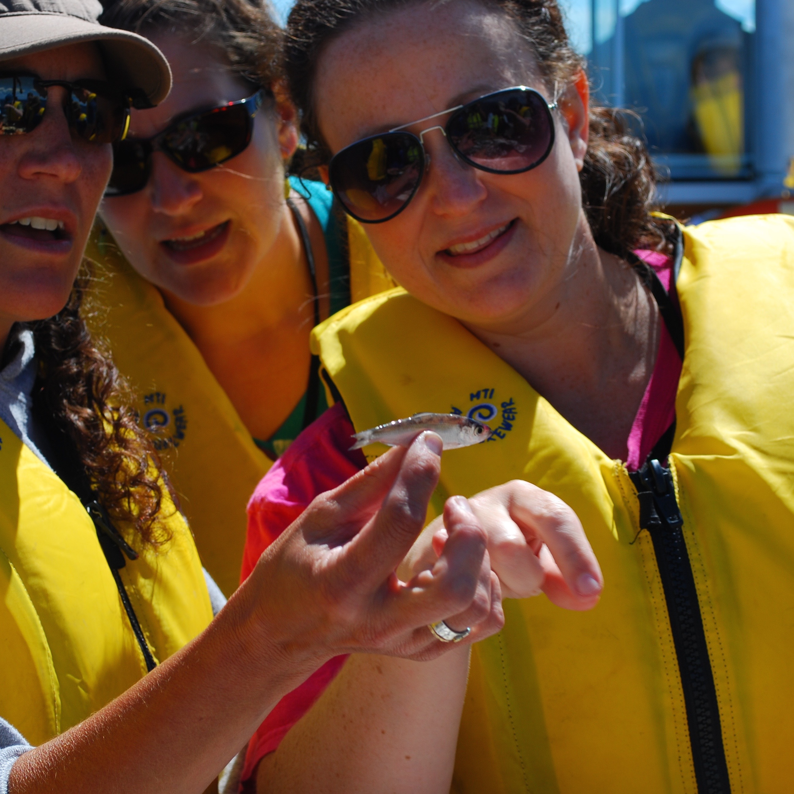
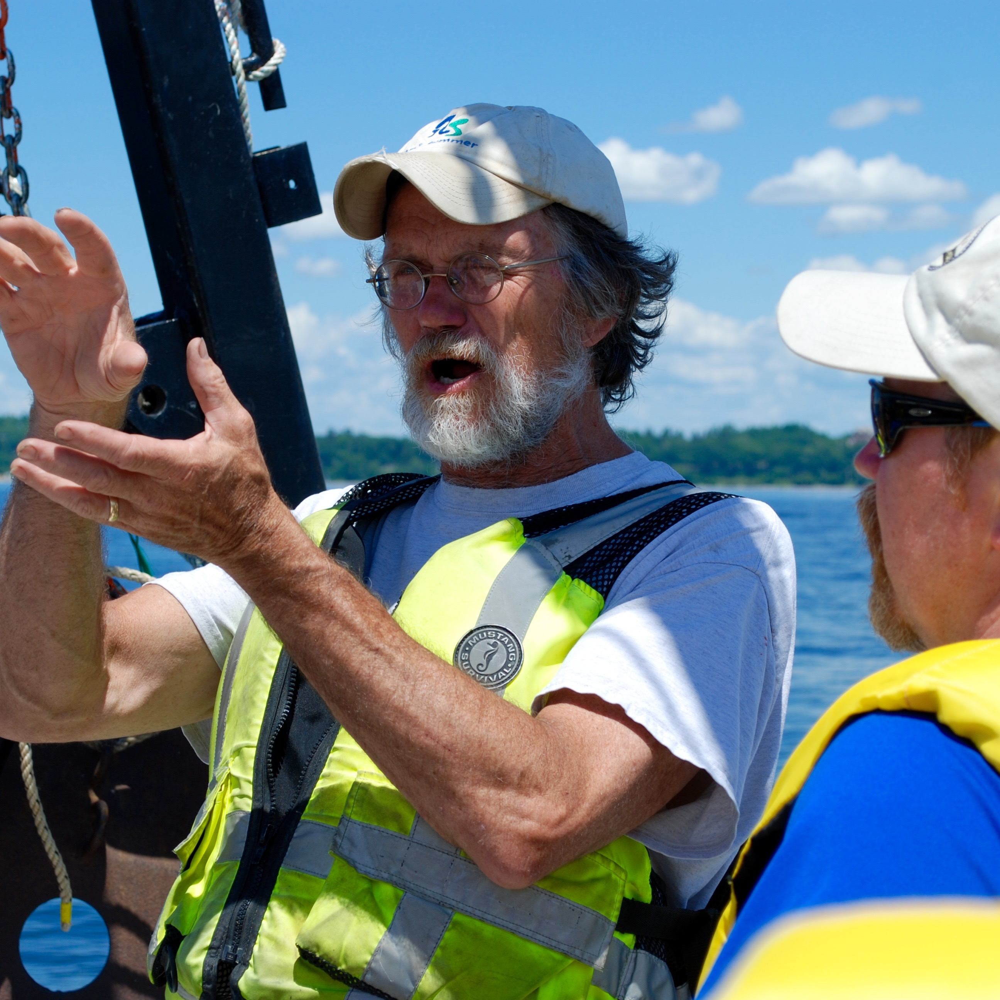
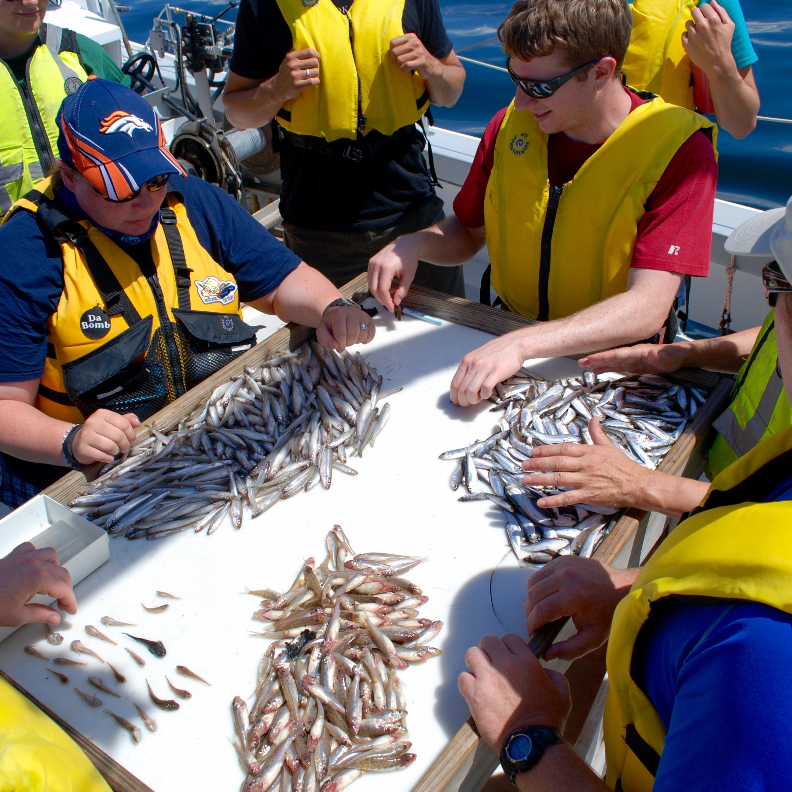
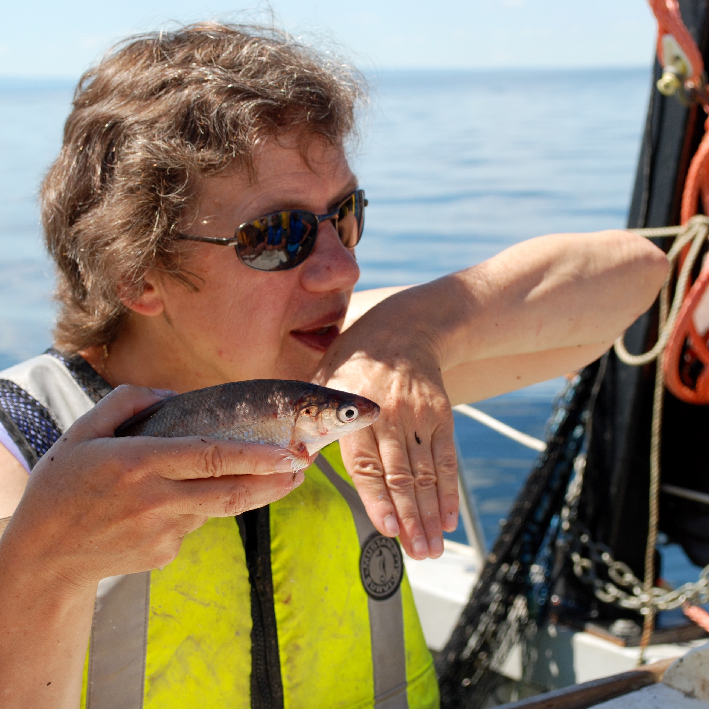
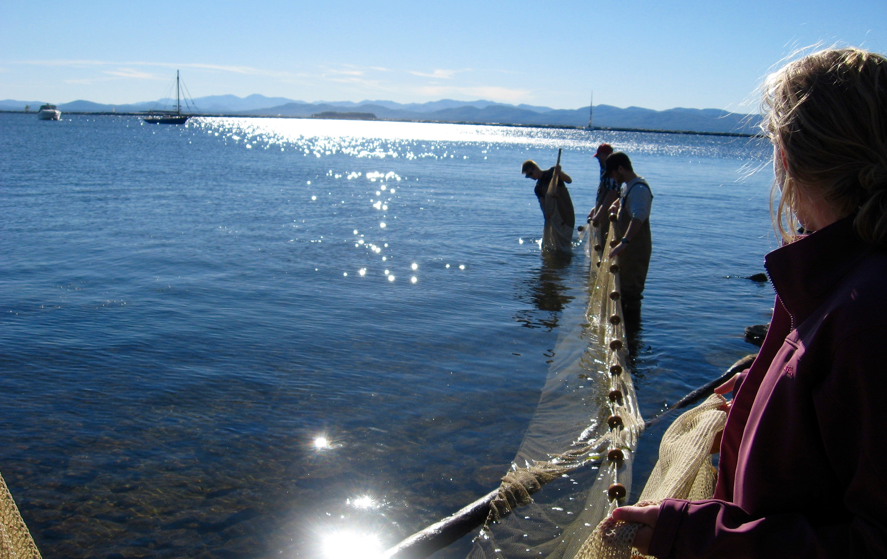

---
title:
output: html_document
---

One of the most important steps in research is the dissemination of knowledge and results to a wide audience. I enjoy working collaboratively with educators and the public to explain my own research and show people that science is accessible to everyone.

  
 

  

    
   
   
	   
   
   
  

  

   
  
***
# R-expo coding workshop
***

The R-expo is a easy alternative to a full R workshop and helps to teach both both basic and advanced coding in R. Participants engage with R experts in different topics in a casual, open space and partake in short, 5 – 10 minute vignettes that focus on a particular R skill or package (e.g. plotting in ggplot, spatial data analysis, building functions and loops). In this setting, presenters in various fields can teach simultaneously, similar to a poster session,allowing participants to engage in topics that they are interested in and learn at their own pace.

  

***

  

   

***
# ECHO Science Translation Fellowship
***

In 2013 I worked with the [ECHO Lake Aquarium and Science Center](http://www.echovermont.org/) for a year as the science-education fellow to create a symbiotic relationship between ECHO and the [Rubenstein Ecosystem Science Laboratory](http://www.uvm.edu/~ecolab/). The goal of my fellowship was to facilitate a relationship where ECHO can benefit from the knowledge and expertise of RSENR researchers while we can benefit from the educational expertise and outreach capacity of ECHO.

  

  

       

   

  

  

***

 

  

    
   
   
	   
   
   
  

  

   
  
***
# CREST teacher workshop
***
The [Champlain Research Experience for Secondary Teachers (CREST)](https://vctm.wildapricot.org/event-2545166) Professional Development Program is a summer workshop that gives 7-12th grade teachers the opportunity to partake in hands on research with professors, udergraduate and graduate students at the University of Vermont.  For three years, I worked as the graduate assistant for the CREST program helping plan and facilitate the week-long workshop.
  

***

  

   
  
***
# Teaching Assistant University of Vermont

***  

- Guest lecturer Conservation Biology, 2015
- Ecosystem Management, 2014
- Ecology, Ecosystems and Environment, 2013
- Limnology, Fall 2012 & 2013

 

  

     

   
  
  

***

Contact me: peter.euclide@uwsp.edu