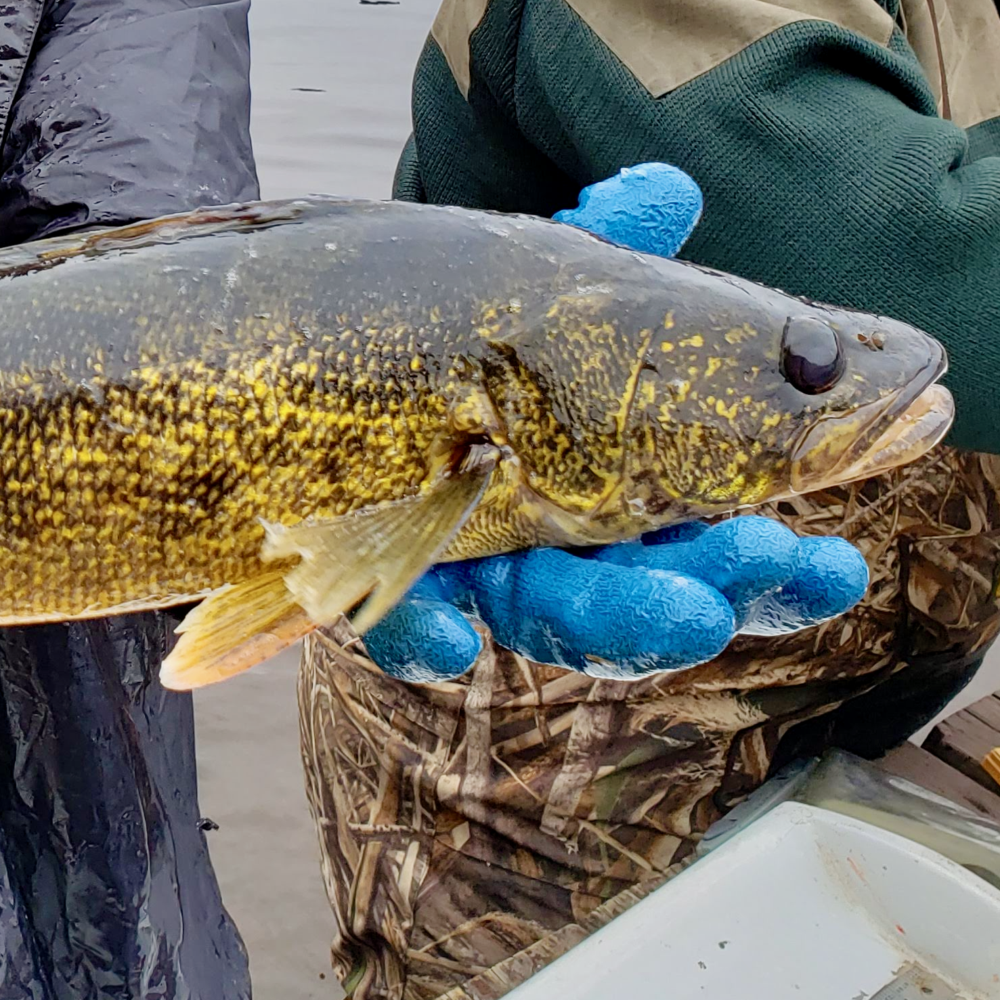

```{r pressure, echo=FALSE, out.width = '100%'}

knitr::include_graphics("photos/ed_banner.jpg")

```

</script>
<div class="row">
<div class="col-xs-12 col-sm-12 text-left">

***

</script>
<br/>
<div class="row">
<div class="col-xs-12 col-sm-5 text-center">
<br/>
 
</div>
<div class="col-xs-12 col-sm-7">
<br/>

# __Peter Euclide, Ph.D.__

I am a research scientist and Illinois-Indiana Sea Grant Fisheries Specialist working at Purdue University. My research uses combination of modern genomic techniques and ecology to answer questions related to animal movement and local adaptation that inform management and conservation. My current research centers around the use of whole genome and reduced representation sequencing to develop GT-seq and Rapture panels to study fish evolution and population structure in the Great Lakes. 

Work areas:

* [Molecular drivers of ecotypic divergence](https://peuclide.github.io/Research#Molecular drivers of ecotypic divergence)
* [Public outreach and science communication](https://peuclide.github.io/ed_and_out.html)
* [Improving management decisions with genetic data](https://peuclide.github.io/Research#Improving management decisions with genetic data)
* [Genetic consequences of habitat fragmentation](https://peuclide.github.io/Research#Genetic consequences of habitat fragmentation)


</div>
</div>

<br/>


***

<center>



<center>
</script>
<br/>
<div class="row">
<div class="col-xs-12 col-sm-12 text-center">

***
