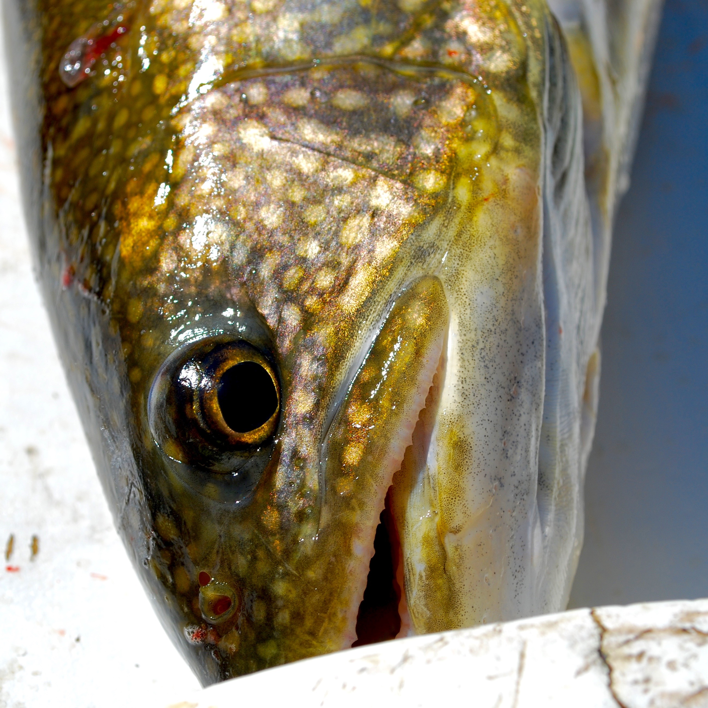
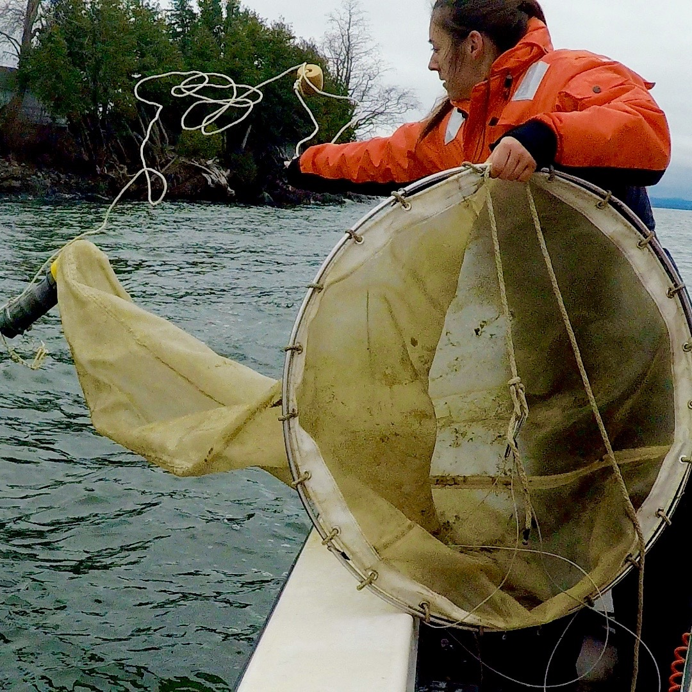

</script>

***

</script>
 

 
 

 

#__Peter Euclide, M.Sc.__
As doctoral candidate at the University of Vermont my reserach focuses on understanding the consequences of habitat fragmentation on the ecology and genetic population structure of five different native fishes. In addition to fish and habitat fragmentation I like:

* [Public outreach and science communication](https://peuclide.github.io/ed_and_out.html)
* [_Mysis_](https://peuclide.github.io/Research.html)
* [Racing fish](https://peuclide.github.io/Research.html)
* RShiny
* <a href="https://peuclide.github.io/Research.html#fish_race">Racing fish</a>

 

***

<iframe src="https://player.vimeo.com/video/245268515?autoplay=1&loop=1" style=float: left; width="250" height="250" margin-right: 1% frameborder=".5" webkitallowfullscreen mozallowfullscreen   allowfullscreen></iframe>

</script>
 

***
<left>
peuclide@uvm.edu
