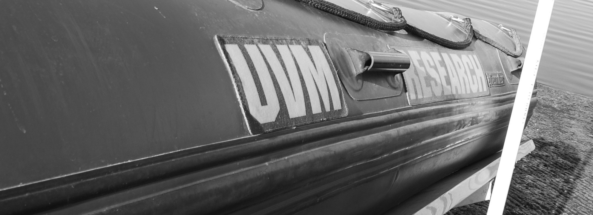
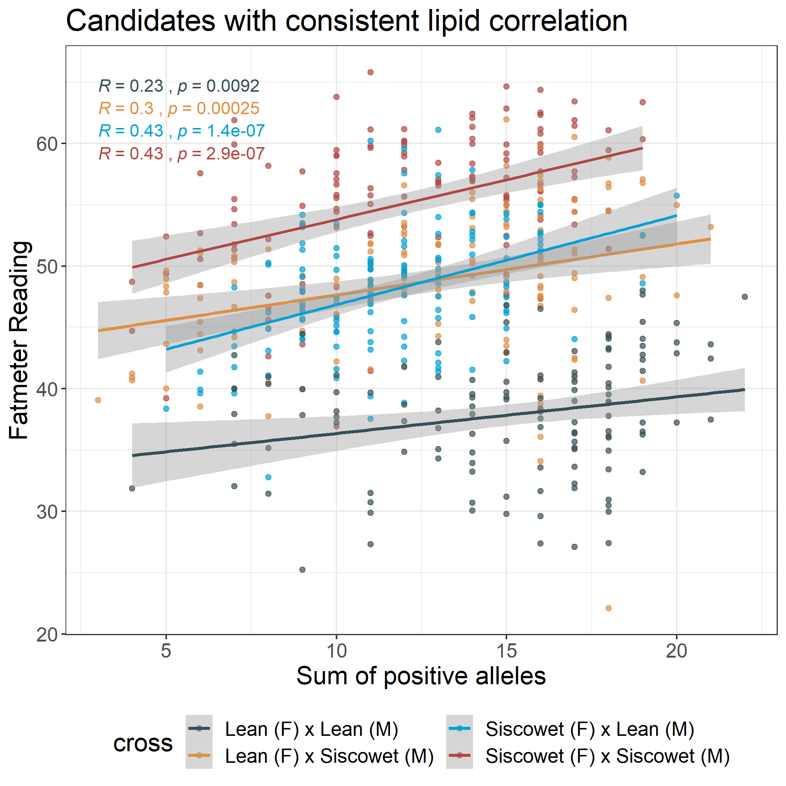

:::: {style="display: grid; grid-template-columns: 60% 40%; grid-column-gap: 10px; "}

::: {}
***  
# __Molecular drivers of ecotypic divergence__
***

Populations are often comprised of discrete ecotypes with distinct morphology or behavior in the absence of reproductive isolation. One of my research objectives is to identify both the molecular mechanisms and environmental drivers of ecotypic divergence. Understanding how local adaptation within a population can lead to diverged ecotypes has important implications for speciation research and the conservation diversity. My work uses molecular techniques, such as RAD-sequencing and whole-genome-resequencing, to identify putatively adaptive variance among ecotypes or populations. Using these approaches, I currently involved in research that is identifying SNPs that are linked to lipid content in F2 experimental lake trout crosses (left) and helping to uncover how structural variants contribute to spawning ecotypes in sockeye salmon. In my own lab, I hope to use these same techniques research river-resident and river-transient smallmouth bass ecotypes which have been repeatedly observed throughout the Great Lakes. 

:::

::: {}

    

:::

::::

***  

:::: {style="display: grid; grid-template-columns: 40% 60%; grid-column-gap: 10px; "}

::: {}

  

:::

::: {}

***  
# __Improving management decisions with genetic data.__
***

Populations are often comprised of discrete ecotypes with distinct morphology or behavior in the absence of reproductive isolation. One of my research objectives is to identify both the molecular mechanisms and environmental drivers of ecotypic divergence. Understanding how local adaptation within a population can lead to diverged ecotypes has important implications for speciation research and the conservation diversity. My work uses molecular techniques, such as RAD-sequencing and whole-genome-resequencing, to identify putatively adaptive variance among ecotypes or populations. Using these approaches, I currently involved in research that is identifying SNPs that are linked to lipid content in F2 experimental lake trout crosses (left) and helping to uncover how structural variants contribute to spawning ecotypes in sockeye salmon. In my own lab, I hope to use these same techniques research river-resident and river-transient smallmouth bass ecotypes which have been repeatedly observed throughout the Great Lakes. 
:::

::::

***

:::: {style="display: grid; grid-template-columns: 60% 40%; grid-column-gap: 10px; "}

::: {}
***  
# __Ph.D. Research__
***

My Ph.D. research focused on understanding how barriers limit fish dispersal and ultimately gene flow which can lead to population sub-structuring across a species range. My current research is at the intercept between behavioral ecology and evolutionary biology using molecular techniques, long-term demography and mark-recapture datasets to describe patterns of genetic diversity and structure in five species of fish native to Lake Champlain in the face of increasing habitat fragmentation.

:::

::: {}

:::

::::

***  

:::: {style="display: grid; grid-template-columns: 40% 60%; grid-column-gap: 10px; "}

::: {}

  

:::

::: {}

***  
# __Masters Research__
***

My interest in behavioral ecology stems from my thesis research on partial diel vertical migration behavior of _Mysis diluviana_ in Lake Champlain. Using a combination of stable isotopes and basic demographic data I determined that gravid females and large _Mysis_ with higher C:N content (lipid content) were more likely to remain on the bottom at night while the rest of the population migrated to the surface to feed.
:::

::::

***

:::: {style="display: grid; grid-template-columns: 60% 40%; grid-column-gap: 10px; "}

::: {}
***  
# __Side Projects__
***

Harmful cyanobacteria blooms are a global issue. Because cyanobacteria have little nutritional value for zooplankton, it is possible that higher trophic levels such as fish are impacted by the influx of nutrition poor cyanobacteria at the base of the food web. Working with a colleague trained in lipid analysis, we conducted a two-month experiment to determine how essential fatty acid poor diets, like what might happen during a long cyanobacteria bloom, impact fish fatty acid content, swimming performance and respiration.

:::

::: {}

  <iframe src="https://player.vimeo.com/video/170673352" width="300" height="300" frameborder="0" webkitallowfullscreen mozallowfullscreen allowfullscreen></iframe>

<a href="https://vimeo.com/170673352">JunkFoodHypothesis</a> from <a href="https://vimeo.com/user38109713">Victoria Pinheiro</a> on <a href="https://vimeo.com">Vimeo</a>.

:::

::::

***

